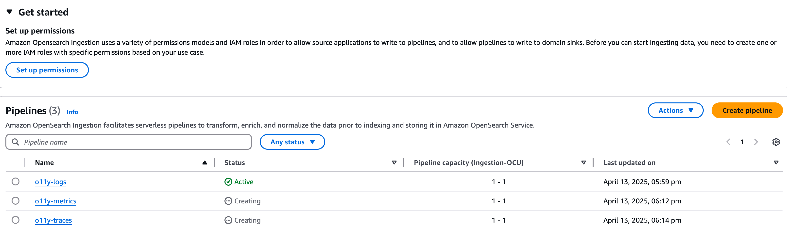

# llmops


```shell
export STACK_NAME=llmops
export APP_VERSION=v0.1
export AWS_REGION=ap-southeast-1
export ACCOUNT=`aws sts get-caller-identity --query "Account" --output text`
export ECR_ENDPOINT=${ACCOUNT}.dkr.ecr.${AWS_REGION}.amazonaws.com
cdk deploy --all --require-approval never 
```

```shell

# openllmetry
cd demo/langchain/ops-agent/
aws ecr get-login-password --region $AWS_REGION | docker login --username AWS --password-stdin $ECR_ENDPOINT
docker build . -t llmops-demo:${APP_VERSION}
docker tag llmops-demo:${APP_VERSION}  ${ECR_ENDPOINT}/llmops-langchain-demo:${APP_VERSION}
docker push  ${ECR_ENDPOINT}/llmops-langchain-demo:${APP_VERSION}

# openlit
cd demo/langchain/ops-agent/
aws ecr get-login-password --region $AWS_REGION | docker login --username AWS --password-stdin $ECR_ENDPOINT
docker build . -t llmops-demo-openlit:${APP_VERSION}
docker tag llmops-demo-openlit:${APP_VERSION}  ${ECR_ENDPOINT}/llmops-langchain-demo-openlit:${APP_VERSION}
docker push  ${ECR_ENDPOINT}/llmops-langchain-demo-openlit:${APP_VERSION}

```

```shell

export AOS_LOGS_INGESTION_PIPELINE_ENDPOINT=o11y-logs-rvxxo4mjr73tymqc44xm2yjqjq.ap-southeast-1.osis.amazonaws.com
export AOS_METRICS_INGESTION_PIPELINE_ENDPOINT=o11y-metrics-j6dj5ezedwaxuvsgoya2pyf2am.ap-southeast-1.osis.amazonaws.com
export AOS_TRACES_INGESTION_PIPELINE_ENDPOINT=o11y-traces-qawchq5o55c5u3ceocusll24ua.ap-southeast-1.osis.amazonaws.com

```

openllmetry / langfuse / openlit

TODOs:

Traceloop: [done]
CloudWatch:
    1. trace [done]
    2. dashboard ?
    3. transaction search [done]

Prometheus:
    1. metrics
Opensearch:
    1. trace
    2. metrics

AOS improvements (refer to [demo in aws-samples](https://github.com/aws-samples/observability-with-amazon-opensearch/)):
    1. change manual ingestion pipeline into automation.
    2. opensearch backend role automation

